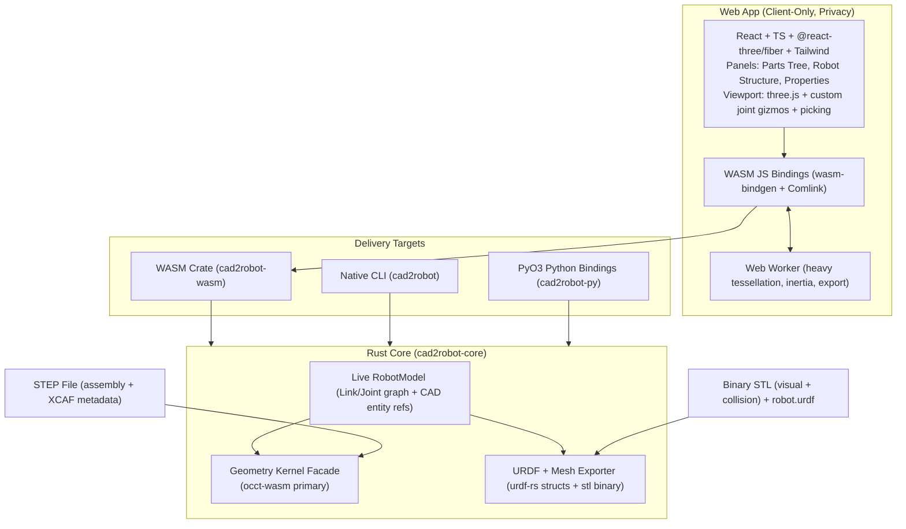
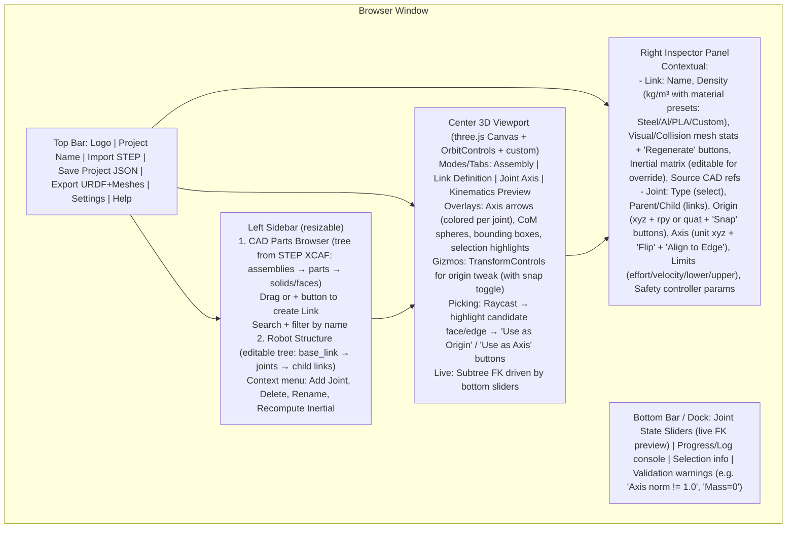

# CAD2Robot Design Document: Web + Rust-Native STEP to URDF Pipeline

**Author**: Grok Systems Architect (placeholder)  
**Date**: 2026-06-07  
**Status**: Draft  
**Version**: 0.1  

---

## Overview

CAD2Robot is a greenfield tool that ingests STEP-format mechanical CAD assemblies (robot arms, grippers, bases, humanoids, etc.) and produces high-quality, simulation-ready URDF robot descriptions suitable for NVIDIA Isaac Sim / Omniverse, ROS, Gazebo, RViz, and related ecosystems.

The core value is eliminating the historically painful manual or plugin-based translation step: users no longer need to remain inside proprietary CAD tools (Fusion 360, SolidWorks, Onshape) or hand-author URDF XML while guessing joint frames, inertials, and mesh separation. A single rich intermediate "Robot Model" representation (richer than URDF) powers live interactive editing, accurate inertial derivation from B-Rep geometry + user density, separate high-fidelity visual vs. lightweight collision geometry, and clean exports.

The system delivers **dual paths** from one Rust core:
- Fully client-side web application (privacy-first: proprietary STEP files never leave the browser).
- Native CLI + PyO3 Python bindings for direct use inside Isaac Sim Python scripts, Omniverse extensions, ROS build pipelines, or CI.

Key technical pillars address the hardest problems in prior art:
- Robust STEP ingestion and geometry queries via a WASM-friendly kernel.
- Semi-automatic + highly interactive joint/link extraction (the #1 historical failure mode).
- Accurate physics properties (mass, CoM, full inertia tensor) computed from solid geometry.
- Professional 3D UX for axis definition with snapping, gizmos, and live kinematics preview.
- Practical WASM constraints (worker offloading, progressive loading, total app payload target < ~15-20 MB).

---

## Background & Motivation

### Current State & Pain Points
Existing CAD→URDF solutions are dominated by desktop plugins and API-bound tools:
- `fusion2urdf` (Fusion 360 add-in), SolidWorks URDF exporter, Onshape-to-robot (Python + Onshape REST API), FreeCAD RobotCAD/cross, `urdf_from_step` (ROS package that requires specially named datum axes/parts in the source STEP).
- Onshape recently added native URDF export (as of ~2026), but still CAD-vendor locked and limited for complex custom pipelines.
- Common failure modes reported across forums, Reddit, and robotics teams: incorrect joint axis directions or origins, missing/inaccurate `<inertial>` (leading to bad sim dynamics), overly heavy or self-intersecting collision meshes, link/joint naming collisions, and brittle re-export when CAD changes.

No strong general-purpose **browser-based** STEP→URDF tool exists. Users working with proprietary or air-gapped CAD data cannot easily use cloud services. Teams targeting Isaac Sim/Omniverse frequently spend hours or days massaging URDFs to satisfy the importer (explicit visual/collision separation, well-conditioned inertials, clean joint frames).

### Why Now / Why Rust + WASM
- **Rust CAD kernels** have matured: `truck` (ricosjp/truck, Apache-2.0, pure-Rust B-rep/NURBS + `truck-stepio`, modular "Theseus' ship" design, explicitly WASM + WebGPU friendly; powers the CADmium web CAD project) and `occt-wasm` (full OCCT V8 fidelity in ~4.5 MB brotli WASM + wasmtime Rust crate; excellent XCAF assembly support, direct queries for volume/CoM/inertia tensor).
- `urdf-rs` (openrr ecosystem) provides a high-quality Rust parser/serializer for the URDF side; the broader openrr/`k` kinematics stack is attractive for future preview features.
- WASM + modern web (Vite, React Three Fiber, Comlink workers) makes sophisticated interactive 3D modeling viable entirely client-side.
- Dual-target (web + native/Py) from one core maximizes leverage and ensures the "source of truth" logic stays in Rust.

The result: a delightful web UX for the common case + scriptable power for simulation pipelines, all without C++ kernel build hell or vendor lock-in.

---

## Goals & Non-Goals

### Goals (v1 Scope)
- Accept real multi-part STEP assemblies from commercial CAD tools.
- Produce URDF + binary STL meshes (primary) that load cleanly in the official Isaac Sim URDF importer (and equivalents in Gazebo/RViz) with minimal manual tweaking.
- Provide an interactive, intuitive web UI/UX that lets a competent user define a usable kinematic tree + inertials + collisions for a typical robot arm/gripper in <30-60 minutes.
- Support live editable intermediate Robot Model (re-derive geometry/inertials from CAD refs without full re-parse).
- Deliver the same core as: (a) WASM for privacy-friendly web, (b) native CLI binary, (c) PyO3 Python module.
- Document Isaac/Omniverse importer settings and recommended URDF patterns.
- Keep total web app payload practical (< ~15-20 MB target including kernel + deps + runtime assets).

### Non-Goals (Explicit v1 Boundaries)
- Full parametric CAD editing or feature history (modeling kernel is used for ingestion + queries + tessellation only).
- Real-time physics simulation (simple forward-kinematics preview + joint sliders OK; full PhysX/Articulation inside the tool is out).
- Fully automatic mechanism recognition / joint inference from pure geometry (heuristic suggestions and snapping aids are in scope; "magic" tree extraction is not).
- Native mobile apps or touch-first experiences.
- Direct USD writing in WASM (future nice-to-have; URDF remains the CAD/ROS bridge).
- Support for every exotic STEP variant or IGES (STEP primary; healing offered where kernel provides).

Success is measured by: real robot STEPs → usable URDF in <1 hour end-to-end → successful load + basic simulation in Isaac Sim without crashes or wildly wrong dynamics.

---

## Proposed Design

### High-Level Architecture



**Layers**:
- **Core lib**: Pure Rust (no_std friendly where possible). Owns authoritative RobotModel, kernel session, all heavy geometry math.
- **WASM bindings**: Thin `#[wasm_bindgen]` surface + worker-friendly async API. Returns serializable snapshots (meshes as Float32Arrays/Uint16, model as JSON-friendly).
- **Web frontend**: Modern SPA. Authoritative model state can live primarily in Rust (with JS mirror for reactivity) or be fully mirrored with Rust as compute service. Prefer Rust ownership for "single source of truth" and easy native parity.
- **Native/Py**: Direct `cad2robot-core` usage. CLI wraps for batch/CLI UX. PyO3 exposes ergonomic Python dataclasses or builder API.

### Kernel Choice (occt-wasm Recommended for v1)

**Primary recommendation: `occt-wasm`** (and its Rust crate sibling).

Rationale:
- Superior real-world STEP fidelity for assemblies exported from Fusion/SolidWorks/Onshape/CATIA (XCAF preserves names, colors, component hierarchy, locations).
- Built-in high-accuracy queries critical to the value prop: `get_volume`, `get_center_of_mass`, `inertia_tensor` (or equivalent properties), bounding boxes — enables exact mass/CoM/inertia from solid B-Rep + user density without mesh approximation error.
- Excellent tessellation control (deflection-based) + face-grouped meshes (useful for per-face material or sub-shape selection).
- Mature Web Worker + Comlink story + arena handles (u32 ShapeHandle) with clean dispose semantics.
- Same artifact powers both browser (Embind) and native (wasmtime) — one build artifact.
- Bundle impact: ~4.5-4.7 MB brotli (far smaller than classic opencascade.js ~9 MB). Total app remains practical.

**Truck (monstertruck fork with explicit wasm) as strong alternative / future path**:
- Pure Rust (Apache-2.0 everywhere, no LGPL considerations for the kernel).
- Modular crates (`truck-stepio`, `truck-polymesh`/`meshalgo`, `truck-topology`, `truck-geometry` NURBS, `truck-modeling`).
- Proven in CADmium browser CAD. Excellent for WASM + potential future GPU (wgpu) viz.
- Downside for v1: STEP support is re-implementation (may lag on exotic B-reps/NURBS from commercial tools); inertia/CoM/volume would require mesh-based approximation or additional integration code.

**Hybrid note**: Core can abstract behind a `GeometryKernel` trait. Initial spike can validate both; v1 ships with one (occt-wasm) + clear extension points. Licensing for occt-wasm WASM payload (LGPL-2.1 for the embedded OCCT) is manageable for web (users can override the `.wasm` URL) and documented.

#### Web Delivery Constraints & Browser Compatibility

occt-wasm (the chosen kernel) has strict requirements (verified from its docs/README):
- **WASM features**: Requires WASM SIMD (baseline), tail calls, wasm-exceptions. Relaxed-SIMD intentionally avoided for cross-CPU reproducibility.
- **Browser matrix** (from occt-wasm):
  | Browser | Min Version | Notes |
  |---------|-------------|-------|
  | Chrome / Edge | 114+ | Full support (tail calls 112+, SIMD) |
  | Safari | 17.2+ | Tail calls (15+), relaxed-SIMD support varies; our build avoids relaxed |
  | Firefox | Not supported | No tail call support as of Firefox 130 (and current); will show warning banner |
- **Graceful degradation**: On unsupported browser, web app shows prominent non-dismissible banner: "This browser lacks required WASM features for the CAD kernel (e.g. Firefox). Full functionality requires Chrome/Edge/Safari or use the native CLI (`cargo install`) / Python package as fallback. Privacy guarantees remain for supported clients." Scaffold falls back to a read-only mesh viewer or "download CLI" CTA. No hard crash.
- **Practical WASM constraints** (re-iterated): ~4.5-4.7 MB brotli kernel + app/ three ~ total target <15-20 MB. Heavy work always in worker (Comlink). Progressive loading for assemblies. Bundle budget enforced in CI (PR10).
- **CADmium precedent**: "Proven in CADmium browser CAD" (truck-based local-first web CAD) is **historical**; the CADmium repo was archived in 2025. It still demonstrates truck WASM viability and browser CAD patterns but is not actively maintained. We qualify it as such in alternatives/risks.

These constraints are called out in Risks & Mitigations (browser row) and Rollout (web demo testing matrix in PR2). If Firefox support becomes product-required, prioritize truck spike earlier (see OQ#1 + kernel facade).

See Alternatives Considered for deeper trade-off matrix.

### Data Model (Intermediate "Robot Model")

The live model is **richer than URDF** and stores back-references to original CAD entities so that changes (density, tessellation params, axis tweaks) can re-derive visuals/inertials/collision without re-parsing the entire STEP.

```mermaid
erDiagram
    RobotModel ||--o{ Link : contains
    RobotModel ||--o{ Joint : contains
    RobotModel ||--|| Metadata : has
    Link ||--o{ GeometryHandle : visual_geometries
    Link ||--o{ GeometryHandle : collision_geometries
    Link ||--|| Inertial : has
    Joint ||--|| Pose : origin
    Joint ||--|| Axis : axis
    GeometryHandle ||--|| MeshSnapshot : cached_tess
    GeometryHandle ||--|| CADRef : source

    RobotModel {
        Metadata meta
        list<Link> links
        list<Joint> joints
    }
    Metadata {
        f64 scale_factor  // 0.001 default (mm STEP → m URDF); user-overridable; applied to all poses, volumes, inertials, meshes
        string source_step_name?
        string project_name
        u32 schema_version
    }
    Link {
        string id
        string name
        f64 density_kg_m3
        list<GeometryHandle> visual
        list<GeometryHandle> collision
        Inertial inertial
        map<string,any> user_metadata
    }
    Joint {
        string id
        string name
        string parent_link_id
        string child_link_id
        JointType type  // Fixed | Revolute | Prismatic | Continuous
        Pose origin
        Axis axis
        JointLimits? limits
    }
    Inertial {
        f64 mass
        Pose origin
        f64[3][3] inertia  // or ixx,ixy,... principal form
    }
    Pose {
        f64[3] xyz
        f64[4] quat  // or rpy
    }
    Axis {
        f64[3] xyz_unit
    }
    GeometryHandle {
        u32? kernel_handle  // session-only opaque (u32 arena id from current kernel instance); not persisted across save/load or native<->web
        string semantic  // primary for persistence/re-derive: "body:base_link", "face:23", "edge:7", "assembly:foo/part:bar"
        MeshSnapshot? visual_tess
        MeshSnapshot? collision_tess
    }
    CADRef {
        string step_label_or_id  // from XCAF or STEP product structure (primary stable ref)
        string part_name_from_xcaf
        Transform local_to_assembly
        // Hybrid strategy (resolved OQ#2 / Issue 9): semantic + optional kernel_handle for *current session* high-fidelity snapping.
        // On project JSON reload or cross-target: fall back to heuristic (raycast on current tess + "closest edge/face") or require re-import STEP for full topology picks.
        // Balances accuracy (session picking) vs. bundle/persistence complexity (no full B-rep serialization in model JSON).
    }
    MeshSnapshot {
        Float32Array positions
        Float32Array normals
        Uint16Array indices
        f64 volume_approx
    }
```

**Key properties**:
- `Metadata.scale_factor: f64` (default 0.001 for mm→m; applied uniformly to Pose xyz, volumes for mass, inertia tensors via scaling rules, mesh vertex positions in tess/export, and joint origins/axes). See Processing Pipeline and WASM API for application points. Per-project override supported with prominent UI warning ("URDF/Isaac convention is meters; source STEP typically mm").
- `GeometryHandle` is the bridge: opaque kernel lifetime handle + serializable semantic ref + cached tessellation (for three.js BufferGeometry) + provenance.
- Inertials computed once (or on density change) from kernel `get_center_of_mass` + inertia tensor, transformed into the link's joint frame (accounting for scale_factor and parallel axis theorem).
- Joint `origin` is a full 6DOF pose (URDF `<origin>`); axis is a unit vector expressed in the joint frame.
- Model is serializable to JSON (for "save project", undo stack, future cloud sync) independently of the original STEP. scale_factor is persisted so re-loads preserve intended units.
- Re-derivation: "Recompute Inertial from CAD" button calls back into kernel using stored CADRef + current density (and current scale_factor).

### Processing Pipeline (STEP → Robot Model → URDF + Meshes)

```mermaid
flowchart TD
    A[Upload STEP bytes] --> B[Kernel: import_step / importXCAFFromSTEP]
    B --> C[Extract XCAF/assembly tree<br/>names, colors, transforms, top-level solids]
    C --> D[Present candidate bodies in UI Parts Browser]
    D --> E[User: Map bodies/subshapes → Links<br/>(auto-suggest by name heuristics + manual drag)]
    E --> F[Per-Link: Set density (or accept project scale_factor=0.001 mm→m default)<br/>Kernel: (volume * scale) → mass, scaled CoM, scaled+transformed inertia tensor<br/>Store Inertial + transformed to link frame]
    F --> G[User: Define Joints<br/>Interactive: pick parent/child links<br/>Pick origin (face/edge/vertex/manual + snap)<br/>Pick axis (edge dir / face normal / 3-pt / numeric)]
    G --> H[Per-Link: Choose/Generate Visual vs Collision geometry<br/>Visual: high-quality tess (user deflection)<br/>Collision: convex hull / decimated / primitive approx via kernel or post-process]
    H --> I[Generate binary STL for each (visual + collision)<br/>Core owns canonical mesh data]
    I --> J[Build URDF structs (urdf-rs compatible or custom writer)<br/>Validate round-trip parse, axis normalization, mass > 0, etc.]
    J --> K[Package: robot.urdf + meshes/*.stl (+ optional manifest.json, glTF sidecar)]
    K --> L[Download zip / save folder<br/>+ Isaac Importer Recommended Settings doc]
```

**Critical details**:
- **Units & Scaling (decided behavior)**: STEP input is treated as mm (industry common); all output (URDF poses, `<inertial>`, mesh vertices in STL, joint axes/origins) must be in meters per URDF/Isaac/ROS convention. Default `scale_factor = 0.001` is applied at ingest (in `loadStep` / model creation) and consistently in:
  - Tessellation vertex positions (MeshSnapshot).
  - `computeProperties` (volume scaled → mass; CoM xyz scaled; inertia tensor scaled per rules + parallel-axis in link frame).
  - Pose/Axis storage and transforms (including FK preview).
  - Export (STL vertices, URDF `<origin>` xyz, `<inertia>` values).
  Prominent UI banner + inspector note on first load/project open. Per-project override allowed (advanced; triggers full re-tess/re-compute). Golden fixtures in tests assert meter-scale outputs (e.g. base_link CoM at ~0.1-1.0 m range for typical arms). This was OQ#6; now closed as hard-coded default + override (see Data Model, WASM, Key Decisions).
- **Tessellation**: Kernel-driven (deflection absolute/relative). Cache per GeometryHandle. Support progressive: coarse for initial preview, refine on demand. Vertices scaled by `meta.scale_factor` before caching in snapshot.
- **Inertial**: Prefer kernel B-Rep properties over mesh. If mesh fallback needed, document approximation limits. Apply parallel axis theorem when transforming CoM/inertia to joint origin (factoring scale_factor). Mass = volume * density (volume from kernel scaled).
- **Collision simplification**: Explicit user control (or presets: "Convex Hull", "10% decimate", "Bounding Box"). Warn that heavy collision meshes kill sim performance. Isaac importer can further simplify ("collision_from_visuals=false" recommended when explicit collision provided).
- **Mesh format**: Binary STL primary (universal URDF compatibility, small, no texture). glTF/OBJ secondary for visual quality or future USD paths. All vertex data emitted at final scale (meters).
- **Naming**: Preserve or sanitize CAD names; ensure unique link/joint names. Provide "Auto-rename with prefix" utility.
- **Frames & Conventions**: All poses/axes follow URDF right-handed conventions (after scaling). Provide visual "frame" overlays and "Flip Axis" / "Align to World" helpers. Common gotcha mitigation: live preview of child link motion around the defined axis. Scale is called out in validation health report.

### Web UI/UX Design

#### Main Screen Layout (Mermaid)



#### Primary Workflows
1. **Upload → Preview**: Drag/drop or button. Worker loads STEP, returns coarse tess + assembly tree. Immediate 3D view of raw geometry (color-coded by part if XCAF provides). "Cancel" for huge files.
2. **Part Browser → Links**: Tree view mirrors STEP hierarchy. Heuristics suggest "link-like" bodies (named *link*, *base*, *arm*, solids with volume > threshold). User creates Links (1:1 or merge multiple bodies into one rigid link). Auto-assigns initial inertial with default density.
3. **Joint Definition (the hardest UX — special attention)**:
   - Select "Add Joint" → choose parent link (highlighted), child link.
   - Origin mode: "Pick from geometry" (raycast on visible meshes; prefer face centroid or edge midpoint; fall back to vertex). "Manual entry + snap to nearest CAD entity".
   - Axis mode: "Pick direction from edge" (vector), "Face normal", "Two points", "World axis", or numeric input + normalize.
   - Visual feedback: Persistent axis arrow (length proportional to child extent), ghosted child link at current angle, "Test Motion" mini-slider.
   - Snapping & constraints: Angle snap, axis perpendicular to face, align to existing joint, "Make revolute axis through CoM projection" helper.
   - Undo per step. Numeric fallback always available for precision.
4. **Tuning**: Per-link density/material, visual vs collision tess params, explicit collision overrides. "Auto-generate convex collision from visual" one-click.
5. **Preview & Validate**: Kinematics sliders update three.js scene (subtree transforms). Validation pass: parse roundtrip with urdf-rs (or equivalent), check for NaN/zero mass/axis norm, self-intersecting? (heuristic), disconnected tree, base link presence.
6. **Export**: Choose format options (STL binary only / +glTF, include materials, package as .zip or flat folder). Show "Isaac Sim Import Checklist" with recommended settings (e.g., collision_type: "Convex Hull" or off if explicit collision meshes provided; merge_fixed_joints per user preference; import_inertia: true).

**Interaction patterns**:
- Consistent selection (highlight in 3D + lists).
- Hover previews (ghost axis, temporary CoM).
- Keyboard: Delete, Escape to cancel pick, G for gizmo toggle, numbers for direct entry.
- Responsive: Panels collapsible; viewport always dominant.
- Accessibility: ARIA on controls, high-contrast mode, keyboard-only joint definition path.
- Performance: Instanced or batched meshes for large assemblies; LOD for preview.

**State management**: Zustand (or Jotai) in JS for UI concerns (selected id, viewport camera state, UI mode). Core RobotModel in Rust WASM is the source of truth for geometry/joints/inertials. Changes flow: UI action → WASM call (update model) → event/callback → JS re-render + three scene sync.

#### Web State & Synchronization Model (detailed contract for "single source of truth")

Rust WASM always owns the authoritative `RobotModel` (including GeometryHandles, cached MeshSnapshots, CADRefs, scale_factor, inertials, joint graph). JS holds only lightweight mirrors (for React reactivity), selection state, camera, and transient view state. This guarantees parity with native/Py paths and makes "save project" (JSON snapshot) always consistent.

**Communication pattern**:
- Primary: Comlink (over Web Worker) for RPC. `getModelSnapshot()` returns a plain `SerializableRobotModel` (JSON-serializable; use structured clone). Mesh data (positions/normals/indices as Float32Array/Uint16Array) returned as Transferable objects for zero-copy where supported.
- Updates are async; heavy ops (tess, inertia, full re-export) always queued to worker.
- On model mutation (addLink, defineJoint, updateDensity, setJointAxis), the WASM side emits (or the caller polls) a diff or full snapshot. JS bridge subscribes (e.g. via proxy or postMessage listener) and updates Zustand store + three.js scene.
- Example flow pseudocode (in `web/src/state/rustBridge.ts` + `useRobotModel.ts`):
  ```ts
  const bridge = await Comlink.wrap(worker);
  const model = await bridge.createRobotModel(0.001);
  // ...
  await bridge.updateLinkDensity(model, linkId, 7850);
  const snap = await bridge.getModelSnapshot(model);  // Serializable incl. meta + updated inertial
  zustandStore.setState({ robot: snap });
  // three scene: for affected link subtree, update BufferGeometry from snap.links[...].visual[0].tess or apply transform only
  ```

**Update granularity & invalidation**:
- Prefer minimal: on joint change, only re-compute/push subtree poses + affected link visuals (not full re-tess unless density or tess params changed).
- On density change: worker re-computes inertial + CoM (cheap kernel call) → snapshot → JS updates inspector + CoM sphere overlay (no full geometry unless requested).
- On link add / joint define with picks: may trigger targeted tessellate for new GeometryHandles.
- three.js side: subscribes to Zustand; uses `useEffect` on snap version or affected IDs to update only `BufferGeometry.attributes` or object3D transforms (for live FK). Instanced/batched for perf on large assemblies.
- Selection/highlight sync: single source (Zustand selectedId/LinkOrJointId) drives left trees (highlight), right inspector (contextual panel), center viewport (highlight + gizmo attach), and picking raycast (prevents cross-mode conflicts).

**Preview vs. committed state**:
- Committed: mutations via bridge always persist to Rust RobotModel (authoritative).
- Transient preview (esp. for "Kinematics Preview" mode and bottom sliders): FK joint angles live only in JS three.js scene (apply recursive transforms to child subtrees using current snap + angle deltas; do **not** mutate Rust model or call setJoint* unless user explicitly "commits" or "bake preview"). This keeps expensive re-derives out of the hot path for "Test Motion".
- On slider drag end or "Apply", optionally call a lightweight `previewJointStates(model, angles)` (if added to API) or just keep visual-only. "Undo" always reverts to last committed Rust snapshot.

**Undo/Redo & persistence**:
- Undo stack lives in JS (Zustand or dedicated history store) as array of prior `SerializableRobotModel` snapshots (cheap since JSON). "Undo" restores by pushing snapshot back via a `loadSnapshot` WASM API (or recreate model and apply diffs).
- "Save Project" / localStorage / download always serializes the current committed Rust snapshot (via getModelSnapshot) + UI camera/selection as sidecar. On load: `createRobotModel(scale)` then apply snapshot data (re-hydrate links/joints; re-attach cached tesses or re-tess on demand; warn on schema_version mismatch).
- Reactivity triggers: density/link change → expensive re-compute (inertial) is debounced + worker-only; UI shows "computing..." spinner from bridge promise.

**Worker vs main boundaries**: All kernel calls (load, tess, compute, export) off main via worker. UI (React trees, forms, simple numeric edits) and three render stay on main. Bridge abstracts; PR2 scaffold includes the initial Comlink + hooks.

This contract makes the "live editable intermediate" claim implementable without drift. Update PR2 (add bridge/hooks files), PR3 (model + snapshot + scale), PR5 (picking + joint mutations), PR8 (FK live preview polish + sliders) file lists. Add e2e tests for sync (Playwright + seeded model) in relevant PRs per Testing Strategy.

#### Primary Workflows

### WASM Public API Surface (Illustrative)

```typescript
// High-level, worker-friendly via Comlink
export interface Cad2RobotWasm {
  // Kernel / STEP
  loadStep(bytes: Uint8Array, options?: { scaleFactor?: number }): Promise<StepHandle>;  // default 0.001 (mm→m); overrides project meta
  getAssemblyTree(handle: StepHandle): Promise<AssemblyNode[]>;
  tessellate(handle: StepHandle | GeometryHandle, options: TessOptions): Promise<MeshData>;  // vertices already scaled per model meta
  computeProperties(shape: GeometryHandle, density: number): Promise<InertialProps>;  // mass, com (scaled), inertia (scaled+transformed per model scale_factor)

  // Model
  createRobotModel(initialScaleFactor?: number): RobotModelHandle;  // defaults to 0.001; persisted in SerializableRobotModel.meta
  addLink(model: RobotModelHandle, spec: LinkSpec): LinkId;
  updateLinkDensity(model: RobotModelHandle, linkId: LinkId, density: number): void;
  defineJoint(model: RobotModelHandle, spec: JointSpec): JointId;  // origin + axis from picks or numeric (values in final scaled units)
  setJointAxis(model: RobotModelHandle, jointId: JointId, axis: [number,number,number]): void;
  getModelSnapshot(model: RobotModelHandle): Promise<SerializableRobotModel>;  // includes meta.scale_factor

  // Export (scale_factor from model is authoritative; URDF + meshes emitted in meters)
  generateMeshes(model: RobotModelHandle, options: ExportOptions): Promise<MeshPackage>; // {stlVisual: Record<string,Uint8Array>, ...} vertices in meters
  exportUrdf(model: RobotModelHandle, meshes: MeshPackage): Promise<string>;  // lightweight emitter owned in core (quick-xml/manual for Isaac fidelity) + urdf-rs only for roundtrip validation/parse
  packageExport(model: RobotModelHandle, meshes: MeshPackage): Promise<Uint8Array>; // zip bytes
}
```

All heavy work (import, tess, inertia, full export) recommended off main thread. Snapshots are plain objects/typed arrays for zero-copy where possible.

### Native + Python Exposure

- **CLI**: `cad2robot convert input.step --out-dir ./robot_description --density 7800 --joint-preset revolute --validate-isaac`. Supports batch, JSON project files (the intermediate model), headless.
- **PyO3**: `import cad2robot as c2r; model = c2r.Model.from_step(open('arm.step','rb').read()); link = model.add_link(...); ...; urdf, meshes = model.export()`. Direct integration in Isaac Sim Python (load without filesystem roundtrip) or Omniverse script editor. Expose dataclasses mirroring the Rust model for ergonomics.
- Versioning: Core semver; WASM and Py wheels published together.

### Isaac Sim / Omniverse Specifics

- Primary output: URDF 1.0 compatible with explicit `<visual>` and `<collision>` per link (separate meshes by default), full `<inertial>` (mass + origin + inertia ixx/ixy/...), correctly oriented joint `<origin>` + `<axis xyz="..."/>`, `<limit>` where applicable.
- Recommended importer settings (documented in-app and README):
  - `collision_from_visuals: false` (use our explicit collision).
  - `collision_type: "Convex Hull"` (or "Convex Decomposition" if user wants; warn on perf).
  - `merge_fixed_joints: true` (or user choice for articulation granularity).
  - `self_collision: false` initially.
  - Import inertia from URDF.
  - Positive scale enforcement / mesh repair options if available.
- Future: Once USD path is added (non-v1), the same model can target direct USD export for "USD as source of truth" teams while still emitting URDF for ROS bridge.

---

## API / Interface Changes

N/A — greenfield project. All interfaces are new.

**Exposed surfaces** (as designed above):
- Rust: `cad2robot_core::{RobotModel, LinkId, JointId, GeometryKernel, ...}` (pub API).
- WASM: The TS interface above + lower-level if needed.
- Python: PyO3 `#[pymodule]` with classes mirroring core types.
- URDF output: Standard schema; we do not extend URDF.

Internal: Kernel facade trait allows swapping truck/occt later.

---

## Data Model Changes

N/A — greenfield. The RobotModel (detailed above) is the canonical persisted artifact (JSON) alongside the generated URDF+meshes.

**Migration / evolution strategy (future)**: Versioned JSON schema for the intermediate model. On load, migrate v0 → v1 (e.g., add new joint fields). Original STEP remains the "source" for re-import if the CAD team iterates the mechanical design.

---

## Alternatives Considered

### 1. Kernel: truck (or monstertruck-wasm) vs. occt-wasm (chosen)

| Aspect                  | truck / monstertruck                          | occt-wasm (recommended)                          | Winner for v1 |
|-------------------------|-----------------------------------------------|--------------------------------------------------|---------------|
| STEP fidelity           | Good (re-impl via ruststep/truck-stepio); risk on complex commercial assemblies | Excellent (full OCCT V8 + XCAF)                 | occt         |
| Inertia / CoM / volume  | Mesh approx or additional code                | Direct B-Rep properties (accurate, fast)        | occt         |
| Bundle (WASM)           | Smaller pure-Rust                             | ~4.5 MB brotli (still practical)                | truck (slight)|
| Licensing (kernel)      | Apache-2.0 clean                              | LGPL-2.1 on WASM payload (practical mitigations)| truck        |
| Native (no WASM)        | Pure Rust, fast compile                       | wasmtime + embedded WASM (~same perf as browser)| truck        |
| Ecosystem / precedent   | CADmium (web CAD)                             | Growing, clean TS/Rust facades, worker support  | Tie          |
| Maturity for robotics   | Promising                                     | Battle-tested OCCT semantics                    | occt         |

**Decision**: occt-wasm primary. Provides the highest probability of "it just works" on real customer STEP files + solves the inertial computation challenge with kernel accuracy. Truck remains viable for a pure-Rust fork or v2 "no external kernel" mode. Abstraction layer makes switch cheaper later.

### 2. Full client-side Rust web vs. Hybrid (JS frontend + Rust WASM core) — chosen is hybrid

Pure Rust web (e.g., egui + wasm + custom renderer) would give pixel-perfect native parity but sacrifices rich ecosystem for UI (trees, forms, complex panels, accessibility) and 3D (mature gizmos, controls, raycasting helpers in three.js). Hybrid (React/TS + three-fiber + wasm core) wins for "professional web UI/UX" goal and faster iteration on interaction design.

### 3. Client-only vs. Optional server backend

Client-only (chosen for v1/privacy): No upload of proprietary CAD. Matches "usable in Isaac Sim and Omniverse" without network. Live editing is snappy once loaded.

Server option (future): Heavy tessellation/inertia offloaded, smaller initial payload, collaborative. Downsides: latency for interactive joint picking, privacy/legal hurdles for CAD data, more infra. Can be added later as "Pro" mode without breaking client core.

### 4. URDF-only vs. Multi-format (USD, SDF, MJCF) from day one

URDF primary (chosen): Matches the explicit request + Isaac/ROS/Gazebo bridge reality. URDF remains the lingua franca from CAD tools.

Multi-format: Valuable (onshape-to-robot does URDF/SDF/MuJoCo). Implement as exporter plugins after core RobotModel is solid. The intermediate model is format-agnostic.

---

## Risks & Mitigations

A consolidated risk register for implementers (solo/small team or otherwise). Pulled from scattered mentions across the doc (kernel choice, WASM constraints, UX, pipeline, Open Questions, Key Decisions) plus additional items identified during review. Reference this section in Rollout Plan and every PR description. Severity uses High/Med/Low; mitigations are actionable with PR linkages.

| Risk | Severity | Likelihood | Impact on Goals | Mitigation & Owner/Phase |
|------|----------|------------|-----------------|--------------------------|
| WASM bundle size & perf/memory for large/complex STEP assemblies (>50-100MB, heavy tessellation/inertia) | High | Medium | Client-only web unusable on modest hardware; violates <15-20MB payload + <30-60min UX goal | occt-wasm ~4.5MB brotli + Comlink worker offload (PR2); progressive/coarse tess first (PR8); explicit memory budget CI gate + "large file" warnings (PR10); lazy sub-assembly load as v1.1. Owner: web + core in PR2/8/10. |
| STEP fidelity / geometry kernel immaturity (exotic B-reps, NURBS, XCAF from commercial CAD; re-impl gaps in alternatives) | High | Medium | "Does not work on real customer files"; wrong volumes/inertials/joints; fails success criteria | occt-wasm primary (full OCCT) + truck spike in PR1 kernel finalization (OQ#1); commit 2-3 public robot STEPs + golden fixtures early (PR1 fixtures + PR10); kernel facade abstraction for swap (PR1); document "try solids-only export" error paths. Owner: PR1 + PR10. |
| Incorrect unit scaling (mm STEP → m URDF) propagating to all coords, volumes, inertials, meshes, joint origins/axes | High | High (if not decided) | Wrong dynamics in Isaac/ROS/Gazebo; "wildly wrong" sim; validation failures | Hard-code default scale_factor: 0.001 (mm→m) in RobotModel + load options; UI warning + per-project override; apply in tess, computeProperties, Pose transforms, inertial parallel-axis, export (see updated Data Model, Pipeline, WASM). Golden tests assert meter-scale (PR3/PR7). Close OQ#6 as decided. Owner: PR3 model + PR7 export. |
| Joint axis/origin definition UX difficulty (historically #1 failure mode); picking fidelity drift or poor snapping | High | Medium | Users cannot produce usable kinematic trees in time; tool no better than prior art | Dedicated PR5 for interactive picking/gizmos/FK preview + numeric fallbacks + snaps; hybrid CADRef (semantic + optional handle); live validation + health report (PR8); "Test Motion" + helpers. Owner: PR5 + PR8. |
| Browser compatibility (occt-wasm requires WASM SIMD + tail calls + exceptions; no Firefox support as of 2025/130) + CADmium precedent archived | High (for web goal) | High (Firefox users) | "Privacy-first fully client-side" excludes significant robotics users (air-gapped or Firefox-preferring); reduces reach | Explicit "Web Delivery Constraints / Browser Compatibility Matrix" subsection (Chrome/Edge 114+, Safari 17.2+; Firefox unsupported with graceful banner + native CLI fallback rec); qualify CADmium as "historical precedent (archived 2025; demonstrates viability)"; add to Risks, Rollout web demo notes, PR2 test matrix. Owner: PR2 + docs (Phase 0). |
| three.js/Rust model sync drift (selection, live FK previews, re-tess on density, undo, subtree transforms) | Medium | Medium | "Live editable" value prop broken; stale viz or incorrect committed state | Dedicated "Web State & Synchronization Model" (Rust authoritative + lightweight JS mirrors; Comlink snapshots + transferable arrays; transient preview layer for FK sliders; event-driven invalidation for affected subtrees; project JSON always from Rust snapshot). Hooks in PR2 scaffold + PR3/PR5/PR8. Owner: PR3/5/8. |
| Inertial accuracy / collision mesh quality (non-uniform density, approx decomps, self-intersect) | Medium | Medium | Bad sim dynamics or perf in Isaac; importer produces wrong colliders | Kernel B-Rep direct for mass/CoM/inertia (occt); explicit visual/collision separation + presets (convex hull default); user override + warnings; geometry accuracy tests vs. known primitives (PR6 + Testing Strategy). Owner: PR6 + PR10. |
| URDF emitter correctness / Isaac importer compatibility (formatting, exact tags, scale, roundtrips) | Medium | Low (with validation) | "Load successfully" fails; extra manual massaging | Own lightweight emitter (quick-xml or manual for Isaac-friendly control) + urdf-rs ONLY for parse/roundtrip validate (close OQ#4); structured validation lints + health report (PR7/8); documented importer settings + "Isaac Sim Import Guide". Owner: PR7. |
| Native (CLI/PyO3) licensing for embedded occt-wasm WASM (LGPL-2.1 OCCT obligations when distributing binaries/wheels) | Medium | Low (if documented) | Compliance risk for Apache-2.0 project releases; users of `cargo install` or Py wheels | Expand licensing notes (Phase 0, Security, Kernel): for all targets document obligations; native embeds trigger source-offer (include LICENSE excerpts + OCCT pointer in releases; build flag for future truck 'no-occt' path). Users of core crate can swap. Verify in PR1. Owner: PR1 + Phase 0. |
| Large assembly / memory exhaustion in browser or kernel (even with workers) | Medium | Medium | Tool crashes on real multi-part robots; limits adoption | Size caps + warnings; progressive tess (PR8); worker isolation; "cancel" + coarse preview; native CLI as escape hatch for very large. Owner: PR2/8/10. |
| Model JSON versioning / re-derive correctness after save/load (CADRef staleness, scale changes, kernel handle lifetime) | Low | Medium | "Save project" loses fidelity or produces inconsistent URDF on reload | Versioned schema from day 1 (Data Model Changes); hybrid CADRef (semantic primary + optional handle); on reload fallback to heuristic or require re-import for high-fid picks (resolve OQ#2/9); re-compute buttons always available. Owner: PR3 + PR10. |

New or amplified risks from review: units conversion errors, browser matrix (esp. Firefox), sync drift, native LGPL for wasmtime embeds, CADmium archival status. All mitigations tie to specific PRs for scheduling buffers.

---

## Security & Privacy Considerations

**Threat model (web)**:
- Primary asset: proprietary mechanical CAD (STEP) containing IP.
- Mitigation: **Zero server involvement** for the web path. All processing (parse, tess, model edits, export) happens in-browser via WASM. Files are loaded via `<input type=file>` or drag-drop into JS `FileReader` / ArrayBuffer → WASM.
- No telemetry by default. Optional anonymous usage stats (link/joint count, export success) behind explicit consent + no file content.
- Supply chain: Pin all deps (including the occt WASM artifact); provide instructions for users to host/serve their own WASM binary to satisfy LGPL replacement requirement.
- **Native/CLI/PyO3 licensing (occt-wasm embeds)**: The Rust crate `occt-wasm` embeds the ~4.7 MB brotli WASM binary and runs it via wasmtime for native targets. Distributing the CLI (`cargo install cad2robot`) or Py wheels therefore distributes a binary containing the OCCT-derived WASM (LGPL-2.1-only). Obligations include: (a) provide source for the LGPL component on request (point to the occt-wasm repo + OCCT git submodule or a build script); (b) include relevant LICENSE excerpts (MIT/Apache for wrapper + LGPL note for OCCT) in releases; (c) allow users to replace the component (documented override or build flag for future truck-only facade). For the Rust crate itself (users depending on cad2robot-core directly), they control their own wasmtime usage and can swap kernels via the facade. Verify occt-wasm crate LICENSE during PR1. This is in addition to web mitigations. See Risks table (native licensing row), Kernel Choice, Rollout Phase 0, and Alternatives.
- WASM sandbox: Kernel runs in its own memory arena; JS cannot arbitrarily corrupt Rust state.
- Export: Generated artifacts contain only geometry the user explicitly modeled + inertials they set. No hidden CAD metadata leakage unless user chooses "include source labels".

**Native/Py path**: Same trust model as running any local binary/Python package. No network calls in core.

**Auth / multi-user**: None in v1 (single-user desktop/web tool). Future collaboration would require explicit design (project files + git or dedicated sync).

**Input validation**: STEP magic number / header checks; size caps (browser memory warning for >100-200 MB assemblies); graceful degradation on parse errors with actionable messages ("STEP contains unsupported entity X; try exporting with 'Export solids only'").

**Data at rest**: Web app may offer "Save project" (JSON of RobotModel, no raw STEP geometry) to IndexedDB or download. User-controlled.

---

## Observability

**Web**:
- On-screen progress (import % if streamable, tess progress, export zip progress).
- Structured console logging (or in-app log panel) with levels. Key events: "STEP loaded: N bodies, M faces", "Inertial computed for link L: mass=2.34kg", "Export validated (urdf-rs roundtrip OK)".
- Performance: `performance.mark` around heavy WASM calls; expose "Stats" panel (triangle counts, kernel call timings).
- Errors: Catch OcctError / wasm panics → user-friendly message + "Copy details for bug report" (sanitized stack + versions). Optional Sentry (opt-in).
- Validation: Post-export "Health Report" (warnings for common Isaac pitfalls).

**Native/CLI**:
- `tracing` + `tracing-subscriber` (structured JSON or pretty). Env `RUST_LOG=debug`.
- Metrics (optional): `metrics` crate for counters (exports, links created) — export to Prometheus or stdout for CI.

**Alerting (hosted web demo if any)**: Standard web vitals + error rate. For the tool itself, success is "user successfully exported valid URDF".

**Testing observability**: Property-based tests on model invariants (axis always unit, tree acyclic, mass >=0, etc.). Golden STEP → URDF fixtures for regression.

---

## Testing Strategy

Geometry, units, inertial transforms, collision approx, picking math, model invariants, WASM/native parity, and 3D UX flows are the highest-risk areas for a tool whose success criteria are "usable URDF in Isaac without wildly wrong dynamics." Testing is **not deferred to PR10**; basic coverage and CI gates are mandated in *every* PR (see PR Plan note). This section defines the upfront strategy.

### 1. Golden Fixtures & Regression
- Commit 2-3 public-domain robot STEPs early (Phase 0 / PR1 fixtures/): e.g. a simple 3-6DOF arm (Franka Panda or UR5 public STEP if licensing allows; otherwise a minimal procedural or GrabCAD-attributed "example_arm.step"), a gripper, a mobile base. Include in repo with `fixtures/README.md` (sourcing instructions, license notes, "how to add new").
- For each: committed expected artifacts (or script to (re)generate):
  - `expected_assembly_tree.json` (names, volumes, top-level structure).
  - `expected_inertials.json` (per-link mass/CoM/inertia at default density + scale=0.001; in meters).
  - `expected_urdf.urdf` + `meshes/` (for end-to-end; URDF must roundtrip-parse cleanly with urdf-rs and pass Isaac lints).
- Script (`scripts/regen-golden.sh` or xtask) to re-generate on kernel updates (with human review diff).
- Tests: load fixture → assert scale-applied CoM in ~0.x m range, mass reasonable, no NaN; export → parse roundtrip + structural checks (links/joints count, axis unit, mass>0).
- PR1: at least one fixture + ingest + volume/CoM assertions. PR7: full export golden. PR10: more corpus.

### 2. Property-Based / Invariant Tests
- Use `proptest` (or `quickcheck`) in core (runs in native `cargo test` and compiled-to-wasm for browser vitest via wasm-bindgen-test or equivalent).
- Core invariants (always, across serialize/deserialize, re-derive, scale changes):
  - All joint axes are unit vectors (norm ≈ 1.0 within epsilon).
  - Tree is acyclic and singly-rooted (one base link with no parent).
  - Mass >= 0 (==0 only for explicit zero-density user choice; warn).
  - Inertia tensor is positive semi-definite (or at least diagonal >=0 after transform).
  - After scale_factor application, all Pose xyz / mesh verts / CoM are in "reasonable" meter range for the assembly bbox (heuristic or fixture-specific).
  - JSON roundtrip stable (schema_version, scale_factor preserved; re-compute from CADRef yields same inertial within eps).
- Run on random valid/invalid model mutations + seeded fixtures.
- PR3 (model): core invariants + snapshot. PR6 (inertial): scale + tensor props. PR10: expand.

### 3. Native ↔ WASM Parity
- Same Rust test binaries/suites compiled for:
  - Native (`cargo test --all`).
  - WASM (via `wasm-pack test --node` or browser; vitest in web/ for JS side).
- Kernel facade: for primitives (box/sphere known volume/CoM/inertia) assert kernel results match analytic within eps (independent of occt/truck).
- Full pipeline parity: ingest same STEP bytes (or fixture) → same model snapshot (modulo handle ids) → same exported URDF/meshes (bitwise on STL or structural).
- PR1: ingest parity skeleton. PR6/PR7: inertial/export parity. CI matrix includes wasm32 + node.

### 4. Geometry Accuracy & Approximation
- For known shapes (unit box, sphere, cylinder from kernel primitives): assert kernel `get_volume` / CoM / inertia vs. closed-form formulas (within 1e-6 or documented eps).
- Mesh fallback (if used): compare CoM/inertia from tessellated surface integral approx vs. kernel B-Rep; document delta and when acceptable.
- Collision: for convex hull preset, assert output mesh is convex (simple test or lib) and encloses original (point-in-hull samples).
- Scale tests: at 0.001 and custom 1.0, assert linear dimensions * scale, volumes * scale^3, inertias appropriately.
- PR1 (kernel), PR6 (inertial/collision), PR10 (harden + more primitives).

### 5. UX / Interaction (Web)
- Unit/logic: vitest + React Testing Library for bridge, Zustand stores, scale application in snapshots, validation lints, picker helpers (mock raycast results).
- E2E flows: Playwright (or vitest + jsdom where possible) with seeded STEP (or in-memory model snapshot):
  - Upload → raw preview visible.
  - Parts → create links → density edit → CoM spheres update.
  - Joint define: pick modes, snap, numeric, "Test Motion" slider (transient only), commit.
  - Export → zip contains urdf + stl; parse checks.
- Visual: optional (Playwright screenshots or percy) for viewport modes/gizmos; brittle so keep minimal + seeded camera.
- Browser matrix: explicit CI jobs or manual notes for Chrome/Edge/Safari; banner test for "unsupported".
- PR2 (scaffold + preview), PR3 (structure + scale), PR5 (joint UX e2e), PR8 (preview polish + health report), PR10 (full suite).

### 6. CI Gates & Mandates (enforced from PR1)
- `cargo test --all` (native) + `wasm-pack test` / `npm test` (web + wasm).
- Bundle size: `du -sh web/dist` or vite analyzer < budget (e.g. 20MB total); fail PR if exceeded without justification.
- Golden: "no drift" (or explicit regen + review).
- Export validation: no zero-mass, axis-norm!=1, parse-fail exports.
- "Each PR includes tests": update PR template or checklist in CONTRIBUTING. PR desc must list "Tests added/changed" + "How to run: `cargo test ...; cd web && npm test`".
- Performance smoke: optional (time a known tess/inertial on fixture; alert on >2x regression).
- PR1 must land with at least ingest + property skeleton + 1 golden fixture + CI jobs for rust + basic wasm.
- PR10 focuses on expansion + visual/accuracy hardening.

This strategy makes the design implementable with confidence that geometry, units, and UX will be correct early. Update Observability "testing observability" bullet if needed; tie explicitly to Risks (fidelity, units, sync, inertial).

---

## Rollout Plan

**Greenfield, no existing users**:
- **Phase 0 (Foundation)**: Repo, workspace, CI (Rust + wasm-pack + vitest/playwright), license (Apache-2.0 for our code; document occt LGPL **for web override + native wasmtime embeds in CLI/Py wheels** — include LICENSE excerpts, OCCT source pointers, and replacement instructions in releases and README), CONTRIBUTING (with PR test mandate checklist), sample public-domain STEP fixtures (e.g., simple arm from open sources). Verify occt-wasm crate licensing during PR1.
- **Alpha (internal / early robotics testers)**: After PR4-5 (basic joint UX + inertial). Share private web build or `cargo install` + Python wheel. Collect feedback on joint definition UX and STEP compatibility via GitHub issues.
- **Beta (public)**: After PR7-8 (full export + validation + docs). GitHub Releases for CLI/wheels; Netlify/Vercel or GitHub Pages for web demo (with large-file note). "Isaac Sim Ready" badge + detailed importer guide.
- **Staged feature flags** (in-app, not runtime Rust flags initially): "Experimental collision decomposition", "Advanced snapping", "glTF sidecar". Toggle in Settings; persisted in localStorage/project.
- **Rollback**: Web is stateless per-session (reload = clean). For native, semantic versioning + changelog. Model JSON versioned from day 1 so old projects load (with migration warnings).
- **Metrics-driven iteration**: Post-beta, optional "Did this load successfully in Isaac?" survey on export. Track common failure exports (zero-mass links, etc.) to prioritize fixes.
- **Long-term**: Once stable, consider Tauri/Electron wrapper for "desktop app" feel (still client-side WASM core), or optional opt-in server for very large assemblies.

---

## Open Questions

1. **Kernel finalization**: After a short spike comparing real robot STEPs (e.g., public Franka, UR5, or custom grippers), confirm occt-wasm vs. truck for coverage. Any gaps in occt-wasm Rust facade for inertia tensor?
2. **Picking fidelity** (see resolved recommendation below): How much CAD topology do we expose for snapping (full face/edge handles vs. mesh + heuristic "closest edge on ray")? Trade-off between accuracy and implementation complexity / bundle. **Resolved in favor of hybrid (see "Picking & CAD Refs Strategy" in Key Decisions + Data Model updates)**.
3. **Multi-body links**: Should a single Link be allowed to aggregate multiple non-connected STEP bodies (common for "base" with electronics)? Or enforce 1 rigid body per Link with explicit "merge" UX?
4. **URDF writer** (closed): Does urdf-rs expose write/serialize today, or do we build a lightweight writer + roundtrip validation via parse? (If only parse, we own the emitter.) **Closed: we own lightweight emitter (quick-xml/manual) in core for Isaac control + use urdf-rs exclusively for parse/roundtrip validation. See updated WASM API, pipeline J, PR7, Key Decisions.**
5. **Convex decomposition quality**: For advanced collision, do we ship a pure-Rust VHACD or similar in WASM, or rely on importer + convex hull + user guidance? (Perf + code size impact.)
6. **Scale / units** (closed): STEP is usually mm; URDF is meters. Hard-code conversion + clear UI warning? Support per-project unit choice? **Closed: default scale_factor=0.001 hard-coded + stored in Metadata + UI warning/override. Applied uniformly. Golden tests required. See Data Model, Pipeline critical details, WASM, Key Decisions, PR3/PR7.**
7. **Materials / visuals**: Preserve color from XCAF into URDF `<material>` + mesh? Or keep simple (one color per link)?
8. **Large assembly streaming**: For >50-100 MB STEPs, can we stream progressive tessellation or lazy-load sub-assemblies? (Nice for v1.1.)

---

## References

- Prior art: fusion2urdf (syuntoku14), onshape-to-robot (Rhoban), urdf_from_step (ROS), SolidWorks exporters, recent Onshape native URDF.
- Rust CAD: https://github.com/ricosjp/truck (and monstertruck fork), https://github.com/andymai/occt-wasm (and opencascade.js contrast).
- URDF: http://wiki.ros.org/urdf, https://github.com/openrr/urdf-rs, openrr/k kinematics.
- Isaac: NVIDIA Isaac Sim URDF importer (now in https://github.com/isaac-sim/IsaacSim source/extensions/isaacsim.asset.importer.urdf and IsaacLab converters); community reports on joint/inertial/collision pitfalls.
- WASM CAD precedent: CADmium (truck + browser CAD).
- Related: truck-tutorial, occt-wasm docs and crate README.

---

## Key Decisions

- **Kernel**: occt-wasm primary (fidelity + direct inertia/CoM/volume from B-Rep + practical WASM size + dual browser/native via same artifact). Truck as alternative with abstraction for future pure-Rust path. Rationale: maximizes "works on real STEP files from commercial CAD" and solves the historically painful inertial step accurately.
- **Intermediate model**: Authoritative richer-than-URDF `RobotModel` in Rust core with `GeometryHandle` + `CADRef` back-pointers for re-derivation. Serializable to JSON independently of STEP. Enables live editing, undo, "save project", and parity between web/native/Py without re-parsing.
- **Web frontend stack**: Vite + TypeScript + React + @react-three/fiber/drei + Tailwind/shadcn-style components + Zustand. Rationale: fastest path to professional, accessible, delightful UX (panels, trees, complex forms, mature 3D gizmos/picking) while keeping heavy geometry in Rust. Pure Rust UI (egui) considered but rejected for ecosystem velocity on interaction design.
- **Joint definition UX**: First-class interactive 3D picking (raycast + snap to CAD entities) + numeric fallback + live FK preview sliders + axis gizmo. This is called out as the #1 historical pain point; dedicated workflow/modes + helpers (align, flip, project to CoM) are non-negotiable for success criterion.
- **Picking & CAD Refs Strategy (resolved OQ#2 / Issue 9)**: Hybrid representation in GeometryHandle/CADRef: `semantic` (XCAF label / part name / "face:NN") is primary and persisted in SerializableRobotModel for re-derive after save/load or cross native/web. `kernel_handle` (u32) is session-only for high-fidelity snapping/picking during a live kernel instance. On reload: fall back to mesh-based heuristic ("closest edge on ray" + centroid) or prompt "re-import STEP for precise topology". Rationale: full persistent topology refs would bloat the model JSON and complicate WASM bundle/lifetime; pure heuristic loses accuracy for complex mating geometry. Traced to Data Model, WASM defineJoint, PR5 picking helpers, re-derivation story. Update PR5 files. This makes "CAD back-refs" concrete and implementable.
- **Delivery model**: Single Rust core (with kernel facade) → WASM bindings + web SPA (client-only) + native CLI + PyO3. No server in v1. Rationale: privacy for proprietary CAD + scriptability inside Isaac/Omniverse Python exactly as requested.
- **Export target**: URDF + binary STL primary (with explicit visual/collision separation and full inertials). Documented Isaac importer settings. glTF/OBJ and USD as follow-ons. Rationale: matches "suitable for Isaac Sim, Omniverse, ROS, Gazebo" and real-world compatibility.
- **URDF writer (closed OQ#4)**: Own a lightweight emitter in core (quick-xml or manual builder for precise Isaac-friendly XML, scale handling, exact <visual>/<collision>/<inertial> tags) + use urdf-rs *exclusively* for parse + roundtrip validation. Rationale: urdf-rs is parser-focused (public API centers on read_file/deser); owning emitter gives control over formatting/compatibility without surprises in PR7 "first end-to-end". Validation pass remains strong. Updated in WASM API, pipeline, PR7, Open Questions.
- **Phasing**: Vertical slices via ordered, independently reviewable+mergeable PRs. Early PRs deliver usable artifacts (raw STEP mesh preview in web after PR2; basic structure after PR3) so value is shown quickly and feedback loops start early.
- **Units & Scaling (closed OQ#6)**: Hard-coded default scale_factor=0.001 (mm STEP → m URDF) stored in RobotModel.meta; applied uniformly in ingest/tess/inertial/Pose/export with UI warning + override. Rationale: prevents the most common silent error in CAD→sim pipelines (wrong dynamics); matches URDF/Isaac/ROS convention; simple to implement/test with golden fixtures asserting meter outputs. Persisted for roundtrips.
- **Risk mitigations called out**: See dedicated "## Risks & Mitigations" section (table with severity/likelihood/impact + PR-linked mitigations). Includes bundle, fidelity, units (now decided), joint UX, browser compat (Firefox), sync drift, native licensing for occt-wasm embeds, etc.

---

## PR Plan

Concrete, ordered, independently valuable + reviewable PRs. Each delivers a working vertical slice or critical foundation. Early PRs produce usable tools (even if incomplete robot model).

1. **PR 1: Repository bootstrap + Rust core skeleton with STEP ingest (native slice)**  
   Files: root `Cargo.toml` (workspace with members = ["crates/core", "crates/cli", "crates/wasm"], [workspace.dependencies] occt-wasm = "3", urdf-rs = "...", tracing = "..."), `crates/core/Cargo.toml` + `src/lib.rs` (pub use) + `src/kernel.rs` (GeometryKernel trait + OcctKernel impl + error handling + basic ingest: load_step, get_assembly_tree, get_volume/com/compute_inertial with scale), `crates/cli/Cargo.toml` + `src/main.rs` (stub `convert` / `inspect` that prints assembly summary + volumes), `README.md` (initial with build/run instructions), `fixtures/README.md` (sourcing: "use public Franka/UR5 STEP or minimal; commit 1 small example_arm.step with license note; use `cargo xtask` or script if added later"), `.github/workflows/ci.yml` (jobs: "rust-test" (cargo test --all), "wasm-build" skeleton, "clippy"), `crates/core/src/model.rs` skeleton (Metadata with scale_factor etc. for PR3 prep), integration test in core that loads fixture and asserts body count + volume >0. CONTRIBUTING.md starter with PR checklist ("tests + demo steps").  
   Deps: None (this PR).  
   Desc: Establishes workspace, dependency choice (occt-wasm), basic kernel session, STEP import via XCAF or compound, entity extraction (names/volumes). CLI gives immediate "cad2robot inspect foo.step" value. Tests prove ingest works on real data (incl. scale skeleton + 1 golden). Reviewable in isolation. How to demo: `cargo run --bin cad2robot -- inspect fixtures/example_arm.step`; `cargo test`. (Non-WASM web scaffold prep can parallel but not required.)

2. **PR 2: WASM bindings + minimal web app with raw mesh preview (first web vertical)**  
   Files: `crates/wasm/Cargo.toml` + `src/lib.rs` (wasm-bindgen exports for loadStep (w/ scale opt), getAssemblyTree, tessellate), `web/` (new Vite + TS + React + three.js + @react-three/fiber scaffold; package.json with key deps `@react-three/fiber`, `@react-three/drei`, `three`, `comlink`, `zustand` (and wasm-bindgen peer), vite.config.ts with `optimizeDeps: { exclude: ['cad2robot-wasm'] }`, `build.target: 'esnext'`, async wasm notes, App.tsx + file input + three canvas that renders coarse tessellated mesh from uploaded STEP + browser compat warning banner component), `web/worker.ts` (Comlink setup + basic bridge), `web/src/state/rustBridge.ts` (initial Comlink proxy + loadStep wrapper), docs/README on running demo + "test matrix: Chrome/Edge latest, Safari 17.2+, expect graceful banner on Firefox". Starter `fixtures/` note.  
   Deps: PR 1 (core). (Non-WASM scaffold portions of web/ and package/vite can be prepped in parallel with PR1; full functional preview + worker interop depends on PR1 WASM exports.)  
   Desc: `npm run dev` in web/ lets a user drag a STEP and immediately see the geometry in the browser (no robot semantics yet). Proves WASM pipeline, worker offload, three.js interop, bundle size reality, and compat banner. Huge early demo value. Independently testable (including on supported browsers + simulated unsupported). Clarified parallelism: scaffold + UI chrome parallelizable; real STEP→mesh requires PR1.

3. **PR 3: Intermediate RobotModel + basic link extraction + structure UI**  
   Files: `crates/core/src/model.rs` (RobotModel + Metadata with scale_factor: f64 (default 0.001), Link, Inertial, GeometryHandle, CADRef, Serializable snapshot + Serialize derives + schema_version), updates to kernel facade for properties + scale application in compute/tess, wasm re-exports + JS model types (incl. scale in snapshots), web: left sidebar Parts Browser (tree) + Robot Structure tree, drag-to-Link, localStorage save/load of model JSON (persists scale_factor + warning UI), basic 3D selection sync, unit conversion banner on load.  
   Deps: PR 1-2.  
   Desc: User can turn STEP bodies into Links, set per-link density (respecting/setting project scale_factor), see auto-computed mass/CoM (displayed as spheres, in meters). Model is live and serializable with units metadata. First "robot description" artifact (even if all fixed joints or single link). Includes unit tests asserting meter-scale outputs on golden fixtures. Usable slice for structure definition. How to demo: load public STEP → inspect model JSON for scale_factor + scaled CoM values; toggle override and observe re-compute.

4. **PR 4: Joint data model + basic definition (parent/child wiring)**  
   Files: Extend core model with Joint, JointType, Pose, Axis; add/define_joint APIs; wasm surface; web: "Add Joint" flow in structure tree, simple parent/child picker (dropdowns + 3D highlight), store in model, basic tree visualization of kinematic hierarchy (no interactive axis yet).  
   Deps: PR 3.  
   Desc: First kinematic trees. Validation (acyclic, connected). Preview of hierarchy in 3D (color links by subtree). Independently reviewable model + minimal UI.

5. **PR 5: Interactive joint origin + axis UX (the hard part)**  
   Files: Core: joint spec with CAD entity refs (hybrid: semantic primary + optional session kernel_handle per resolved picking strategy); picking helpers (project point to face/edge using kernel or heuristic on tess, edge direction vector, face normal); updates to GeometryHandle/CADRef serialization; web: new "Joint Axis" viewport mode, raycasting + highlight (three ray + semantic lookup), "Use selected face centroid as origin", "Use edge direction as axis", gizmo (TransformControls) for manual tweak with snap, numeric inspector fields that round-trip, live axis arrow + "Test Motion" slider (applies temp FK to child in three scene per State Model; transient only), flip/align helpers, "re-import for precise topology" note on heuristic fallback. Add e2e Playwright test for pick→define flow (per Testing Strategy).  
   Deps: PR 4.  
   Desc: The core UX that differentiates from all prior tools. Users can now define real revolute/prismatic joints intuitively (with documented hybrid fidelity). Includes fallbacks. This PR alone makes the tool dramatically more useful than existing exporters for complex cases. How to demo: create joint via face/edge pick; save JSON project; reload (observe heuristic fallback or note); re-import STEP and re-pick for high-fid.

6. **PR 6: Full inertial + collision mesh generation + tuning**  
   Files: Core: inertial computation pipeline (kernel props → transformed tensor), collision options (hull, decimate via kernel or simple algo); model fields for separate visual/collision handles + cached meshes; wasm export of inertial + mesh stats; web: right inspector density/material presets + "Recompute", collision preset dropdown + "Regenerate collision", CoM visualization, warnings for zero/negative mass.  
   Deps: PR 3,5 (needs links + joints).  
   Desc: Completes the physics-ready model. Users can now tune and see accurate inertials + explicit collision geometry.

7. **PR 7: URDF + mesh export + packaging + basic validation**  
   Files: Core: STL binary writer (or dep like `stl_io` or pure; vertices emitted post-scale), URDF emitter (owned lightweight implementation using quick-xml or manual string builder for full control over Isaac-friendly tags/formatting/scale; + roundtrip parse validation using urdf-rs only), zip packaging (or return file map); wasm bindings for generate/export (incl. scale_factor propagation); web: Export button → options dialog (visual/collision quality, include materials, confirm/override scale) → download .zip (robot.urdf + meshes/*.stl) + on-screen "Isaac Sim Import Guide" with recommended settings + scale note; CLI gains real `--export` path + `--scale 0.001`. Unit/golden tests asserting meter-scale URDF values + roundtrip validity.  
   Deps: PR 6.  
   Desc: First end-to-end usable output. User can take a real STEP through the full flow and load the result in Isaac/RViz/Gazebo (with correct meter units and inertials). Validation catches common mistakes (incl. scale). Huge milestone PR. How to demo: full flow on public STEP → load URDF in RViz/Isaac preview → verify link positions ~0.1-2m range, no unit-related explosion.

8. **PR 8: Kinematics preview polish, validation report, docs & Isaac guidance**  
   Files: Core: FK preview engine (simple recursive pose application, or integrate `k` from openrr later); richer validation (axis checks, mass, tree, Isaac-specific lints); web: full joint sliders dock with live update, health report panel on export, in-app help/tooltips + embedded importer settings, sample projects, "Load demo robot" button; README + docs/ expanded with screenshots, workflow guide, troubleshooting.  
   Deps: PR 5,7.  
   Desc: Makes the experience "delightful" and trustworthy. Users get immediate feedback and guidance to produce importer-clean URDFs. Completes the primary success criteria for web UX.

9. **PR 9: Native + Python productionization + examples**  
   Files: Polish CLI (full flags, JSON model roundtrip, --validate), PyO3 crate (`crates/py/`) with `#[pyclass]`, `setup.py`/`pyproject.toml` or maturin, Python examples (load STEP, set joints, export, minimal Isaac Sim snippet), wheel CI, docs for "Using inside Omniverse extension" and "headless ROS description generation".  
   Deps: PR 1,7 (core export solid).  
   Desc: Delivers the "Rust-native ... WASM form usable in Isaac Sim and Omniverse etc." requirement in full. Early adopters can integrate directly in Python without the web UI.

10. **PR 10: Hardening, alternatives, performance, tests (optional but high value)**  
    Files: More public STEP test corpus + golden exports, property tests on model invariants, bundle size budget CI check, progressive tess / memory profiling, glTF sidecar exporter, basic material preservation, "Re-import STEP and diff" helper, accessibility audit, CONTRIBUTING for kernel swap (truck), open questions resolution notes.  
    Deps: All prior.  
    Desc: Production readiness, regression safety, and path to v1.1/v2. Can be split or landed post-beta if needed.

**PR dependencies & parallelism note**: PR 1 (core + native CLI skeleton + basic ingest tests + occt-wasm dep + workspace layout) and the *non-WASM portions* of the web scaffold (Vite/React/TS/three setup, file drop UI, placeholder canvas, package.json/vite.config without functional WASM interop, compat banner stub) can proceed in parallel. Full PR2 (WASM bindings + working STEP→coarse-mesh preview via real loadStep/tessellate + Comlink worker + bridge hooks + browser matrix testing) **depends on PR1**. PR3 depends on both. 4-6 sequential on model. 7-8 on export+UX. 9 once 7 solid (native independent of full web). 10 last-mile. Each PR must include: updated docs/README, tests (per Testing Strategy), and explicit "how to demo this slice" (with commands + expected output). Early PRs emphasize vertical value even if incomplete (e.g. PR2 is a working STEP viewer before any RobotModel).

---

*End of Design Document. This is the foundation for all implementation. Implementers should treat the PR Plan as the execution roadmap and the Key Decisions + Data Model + UX sections as non-negotiable for meeting the user request and success criteria.*
